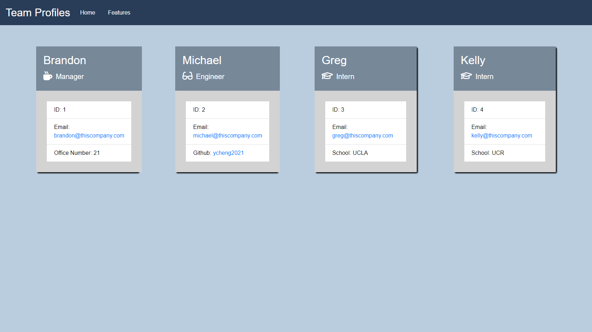

# Profile Generator

## Description
Profile generator is a command-line application that accepts user input to generate employee cards onto a HTML file. The user is prompted to choose the employee role, which are managers, engineers, and interns. Once the user chooses the role, then questions specific for that role will be prompted. The user will be able to generate more profiles once the questions for that role is answered and when the user chooses "I am done", the HTML file will be generated.

## Table of Contents

- [Installation](#installation)

- [Usage](#usage)

- [Contributing](#contributing)

- [Tests](#tests)

- [License](#license)

- [Questions](#questions)

## Installation 
The user will need to fork or clone this repository in order to use its features. User will also have to type npm i in their terminal to download inquirer and jest 

## Usage 

## Contributing
No contributing guidelines right now

## Tests
npm i

## License
This application does not have a license.

## Questions
Github link: https://github.com/ycheng2021

Video link: https://drive.google.com/file/d/10ORXqMncIcTvirbT6uPMbZgmFZ8GvuJh/view

If you have any additional questions, feel free to reach me at annacheng09@hotmail.com
